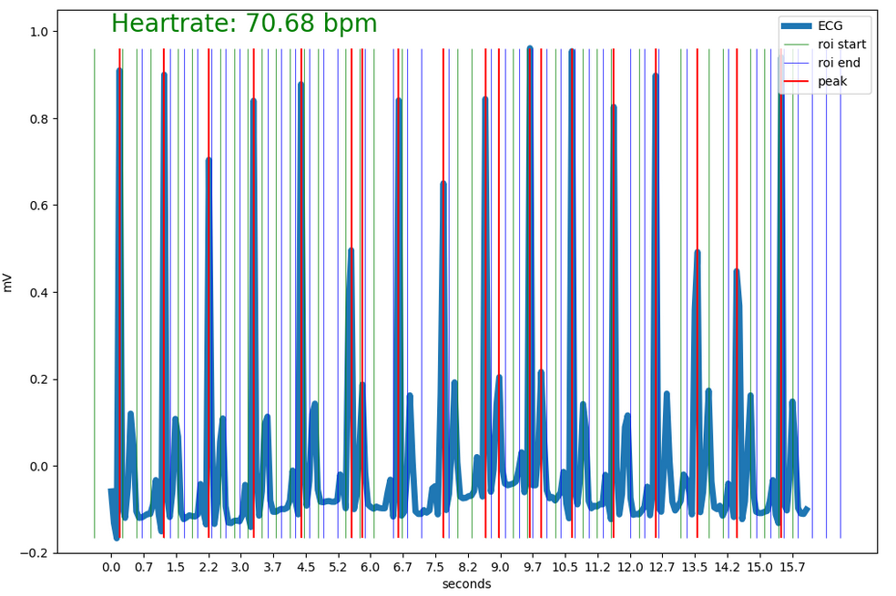
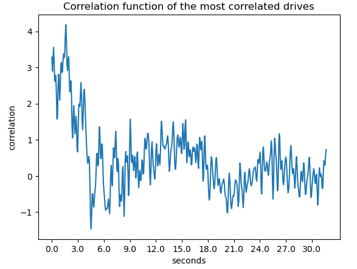
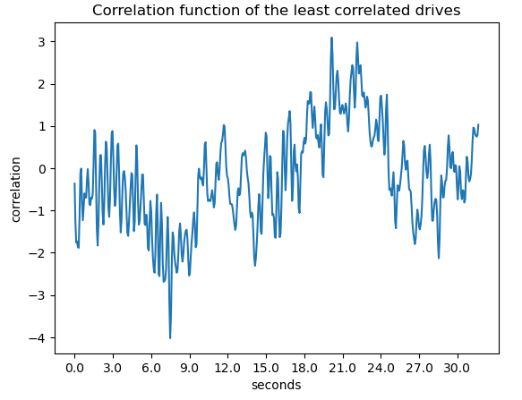

# Semestrální práce KI/PZS - zpracování EKG a EMG

Datum: 5.2.2023

Kolaborace: Jakub Kopecký


## 1. Výpočet tepové frekvence z EKG signálu

### Zadání

Ve zdrojové databázi najdete celkem 17 měření EKG signálu. Signál je již filtrován a
centralizován kolem podélné osy. EKG signál obsahuje dominantní peaky, které se nazývají R
vrcholy. Vzdálenost těchto vrcholů určuje dobu mezi jednotlivými tepy. Počet tepů za minutu
je tedy počet R vrcholů v signálu o délce jedné minuty. Navrhněte algoritmus, který bude
automaticky detekovat počet R vrcholů v EKG signálech a prezentujte tepovou frekvenci při
jednotlivých jízdách/měřeních. Vás algoritmus následně otestujte na databázi MIT-BIH
https://physionet.org/content/nsrdb/1.0.0/ a prezentujte jeho úspěšnost vzhledem
k anotovaným datům z databáze.

### Postup řešení

Signál nejdříve projde okénkovou fourierovou transformací, poté se detekuje dominantní frekvence podle Ntého percentilu a vytváří se regiony s potenciálním R peakem. Dané regiony se poté prozkoumají a porovnává se maximální hodnota daného regionu s hodnotou Ntého percentilu celého signálu. Pokud daná maximální hodnota regionu přesáhne práh, označí se jako R peak. Nakonec se z počtu detekovaných R peaku vypočítá tepová frekvence.

### Výstup

Detekované R peaky a tepová frekvence pro signál drive12 z datasetu physionet DRIVEDB: \



Následné otestování detekce R peaků s tolerancí 0.01 % proti anotovanému datasetu NSRDB:

```
nsrdb/16539: correct peaks: 83.288 %
nsrdb/16265: correct peaks: 72.058 %
nsrdb/16795: correct peaks: 59.207 %
nsrdb/18184: correct peaks: 62.948 %
nsrdb/16786: correct peaks: 66.805 %
nsrdb/16272: correct peaks: 68.305 %
nsrdb/19088: correct peaks: 56.553 %
nsrdb/16420: correct peaks: 64.471 %
nsrdb/17453: correct peaks: 81.625 %
nsrdb/19090: correct peaks: 77.178 %
nsrdb/16773: correct peaks: 48.670 %
nsrdb/19093: correct peaks: 72.425 %
nsrdb/18177: correct peaks: 64.568 %
nsrdb/19140: correct peaks: 65.796 %
nsrdb/16273: correct peaks: 68.866 %
nsrdb/16483: correct peaks: 68.147 %
nsrdb/19830: correct peaks: 73.736 %
nsrdb/17052: correct peaks: 64.758 %
Average correct: 67.745 %
```

### Závěr

Tento postup pro detekci R peaků určitě není dokonalý a opravdu záleží na nastavení jeho parametrů (Ntý percentil, velikost okna). Pro ideální EKG signál může být dostačující, ale pokud se v signálu objevují poklesy nebo vychýlení, tak spolehlivost tohoto algoritmu klesá vzhledem k jeho povaze detekovat R peaky proti globálním hodnotám signálu.

## 2. Výpočet korelace EKG signálů


### Zadání

Ve zdrojové databázi najdete celkem 17 měření obsahující EKG signál. Signály jsou již filtrované
a centralizované kolem podélné osy. Různá měření jsou získána s různou vzorkovací frekvencí.
U všech signálů analyzujte vzorkovací frekvenci a proveďte sjednocení na tu dominantní z nich.
Pro tyto převzorkované signály proveďte korelační analýzu a prezentujte, jak jsou si signály
napříč měřeními podobné. Pro smysluplné provedení této analýzy je potřeba nejprve srovnat
signály na stejný počátek, např. dle pozice prvního dominantního R peaku. Protože se délky
jednotlivých signálů neshodují, je také nutné zvolit vhodnou délku korelační funkce, a to
například analýzou autokorelačních funkcí samostatných signálů.

### Postup řešení

Signál se nejříve převede na dominantní frekvenci celého setu signálů DRIVEDB, poté se odsekne začátek až do prvního dominantního R peaku a následně se všechny signály srovnají se stejnou délku. Korelační koeficient je počítán pomocí funkce `np.corrcoef` a korelační funkce pomocí funkce `scipy.signal.correlate`.

### Výstup

Kolerační matice EKG signálů DRIVEDV pro prvních 1000 hodnot:\


Největší korelace pro prvních 1000 hodnot je mezi drive01 a drive04 a nejmenší korelace mezi drive08 a drive09.

Korelační funkce pro signály s největší korelací:\


Korelační funkce pro signály s nejmenší korelací:\


### Závěr

U této úlohy bylo nejsložitější srovnat signály podle prvního dominantního R peaku, který nebyl vždy správně u některých singálů detekován. Je zde také vidět, jak se liší korelační funkce pro dané signály podle jejich korelačního koeficientu.

## 3. Klasifikace EMG signálů

### Zadání

Ve zdrojové databázi najdete celkem 17 měření EMG signálu. Signál je již filtrován a
centralizován kolem podélné osy. EMG signály zachycují aktivitu svalů během jízdy. Pro všech
17 měření spočítejte integrované EMG (iEMG) pomocí vzorce\


kde, t je doba záznamu, f(t) je EMG signál a | | symbolizuje absolutní hodnotu. Dále
detekujte oblasti, kde u jednotlivých signálů dochází k nárůstu a poklesu aktivity, a to pomocí
okénkové varianty iEMG a derivace funkce. Velikost okénka zvolte tak, aby byly výsledky
statisticky spolehlivé.

### Postup řešení

Nejdříve je signál převeden na absolutní hodnotu (rektifikace), poté buď se spočítá okénková integrace pomocí funkce `np.convolve` nebo integrovaný celý signál pomocí sumace.


### Výstup

Integrované EMG pro všechny jízdy v DRIVEDB:

```
drive01 iEMG: 7.255
drive02 iEMG: 1623.451
drive03 iEMG: 1081.013
drive04 iEMG: 18347.286
drive05 iEMG: 461.068
drive06 iEMG: 229.474
drive07 iEMG: 56.914
drive08 iEMG: 254.910
drive09 iEMG: 901.811
drive10 iEMG: 304.416
drive11 iEMG: 294.905
drive12 iEMG: 247.943
```

Detekce změn v EMG signálu pomocí okénkové varianty iEMG a derivace pro drive01 z DRIVEDB. V zeleném intervalu signál jednoznačně stoupá, v červeném jednoznačně klesá a v nevyznačeném není detekován jednoznačný pohyb.\


### Závěr

U celkového integrovaného EMG pro všechny jízdy je vidět, jak se celková aktivita během různých jízd odlišuje. Algoritmus pro detekci změn v okénkové variantě integrovaného EMG také závisí na nastevení jeho parametrů (velikost okna a prahová hodnota) a tak nemusí být pro všechny případy vhodný.